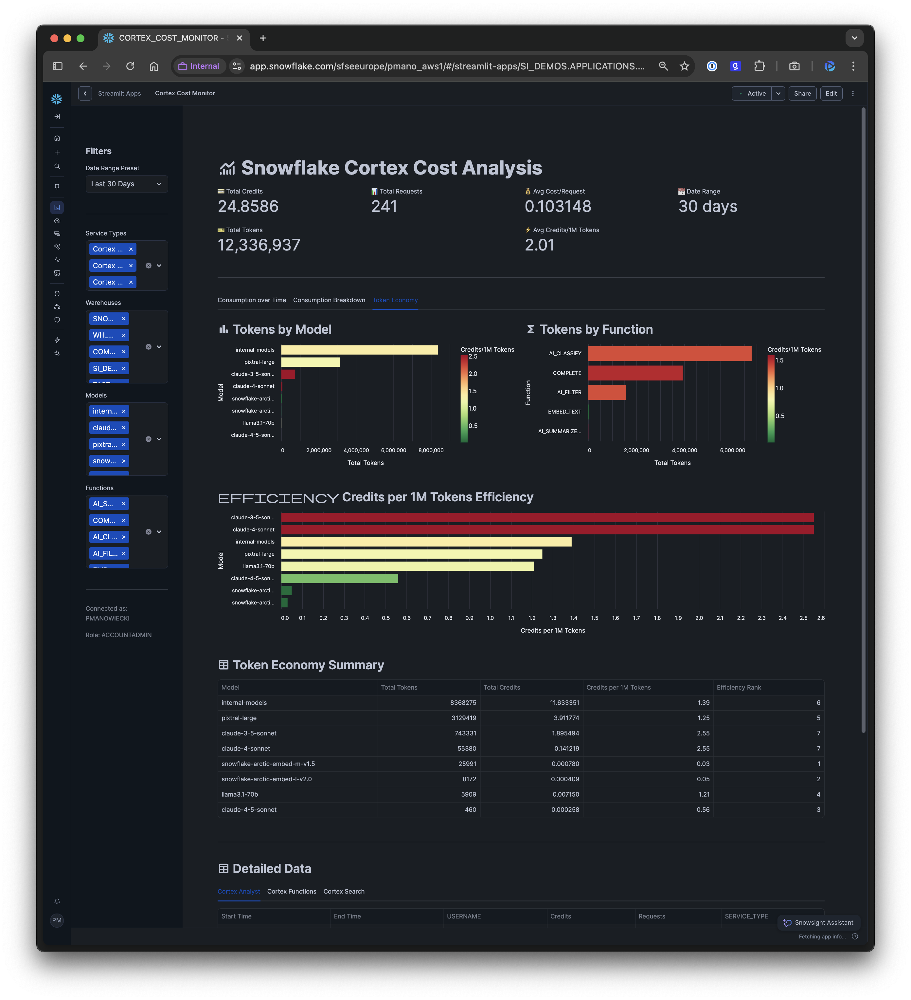
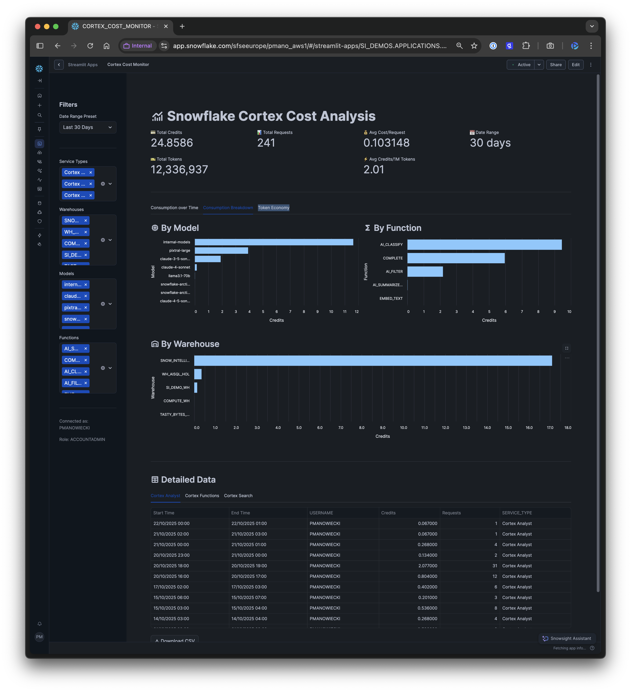
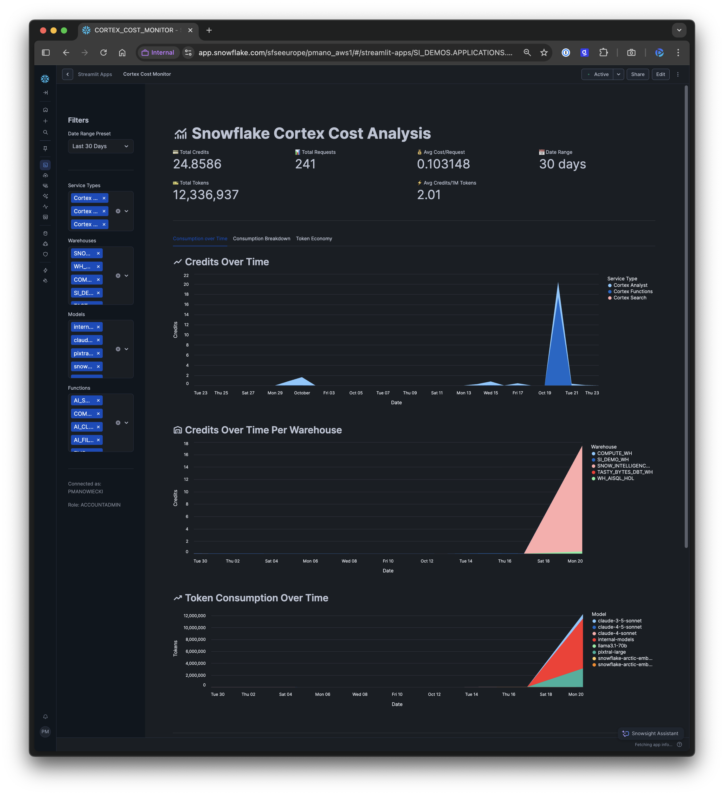

# Cortex Cost Monitor

A comprehensive Snowflake Streamlit application for monitoring and analyzing Snowflake Cortex AI usage and costs across your account.


## Screenshots

### Overview Dashboard


### Consumption Analytics


### Token Economy Analysis


## Features

### 📊 Comprehensive Cost Tracking
- **Real-time Monitoring**: Track credits, requests, and token consumption across all Cortex services
- **Multi-Service Support**: Monitor Cortex Analyst, Cortex Functions, and Cortex Search
- **Time-Series Analysis**: Visualize consumption patterns over time with interactive charts

### 🎯 Key Metrics
- 💳 Total Credits consumed
- 📊 Total Requests made
- 💰 Average Cost per Request
- 🎫 Total Tokens processed
- ⚡ Average Credits per 1M Tokens

### 📈 Interactive Visualizations

#### Consumption over Time Tab
- **Credits Over Time**: Stacked area chart showing credit consumption by service type
- **Credits Per Warehouse**: Track which warehouses are consuming the most credits
- **Token Consumption**: Monitor token usage by model over time

#### Consumption Breakdown Tab
- **By Model**: Compare credit consumption across different AI models
- **By Function**: Analyze usage by Cortex function type
- **By Warehouse**: Identify warehouse-level cost patterns

#### Token Economy Tab
- **Token Distribution**: View token consumption by model and function
- **Efficiency Analysis**: Color-coded charts showing credits per 1M tokens
- **Cost Optimization**: Identify the most cost-effective models for your workloads

### 🔍 Detailed Data Export
- Raw data tables for all Cortex services
- CSV export functionality
- Granular filtering by warehouse, model, and function

## Installation

### Prerequisites
- Snowflake account with ACCOUNTADMIN or appropriate privileges
- Access to SNOWFLAKE.ACCOUNT_USAGE schema
- Python 3.11+ (for local development)

### Deploy to Snowflake

1. **Set up the stage and upload files**:
```sql
USE ROLE ACCOUNTADMIN;
USE DATABASE <your_database>;
USE SCHEMA <your_schema>;

-- Create stage for Streamlit files
CREATE STAGE IF NOT EXISTS CORTEX_COST_APP_STAGE;

-- Upload files (from SnowSQL or Snowflake CLI)
PUT file://streamlit_app.py @CORTEX_COST_APP_STAGE OVERWRITE=TRUE AUTO_COMPRESS=FALSE;
PUT file://environment.yml @CORTEX_COST_APP_STAGE OVERWRITE=TRUE AUTO_COMPRESS=FALSE;
```

2. **Create the Streamlit app**:
```sql
CREATE STREAMLIT CORTEX_COST_MONITOR 
FROM '@CORTEX_COST_APP_STAGE' 
MAIN_FILE = 'streamlit_app.py';

-- Set the warehouse
ALTER STREAMLIT CORTEX_COST_MONITOR 
SET QUERY_WAREHOUSE = <your_warehouse>;
```

3. **Access your app**:
Navigate to Streamlit Apps in your Snowflake account and open CORTEX_COST_MONITOR.

### Local Development

1. **Clone the repository**:
```bash
git clone https://github.com/yourusername/cortex-cost-monitor.git
cd cortex-cost-monitor
```

2. **Set up environment**:
```bash
# Using conda
conda env create -f environment.yml
conda activate streamlit_cortex_cost

# Or using pip
pip install streamlit pandas snowflake-snowpark-python altair
```

3. **Configure Snowflake connection**:
Set up your Snowflake connection in `~/.snowflake/connections.toml` or set the `SNOWFLAKE_CONNECTION_NAME` environment variable.

4. **Run locally**:
```bash
streamlit run streamlit_app.py
```

## Configuration

### Date Range Filters
- Last 7 Days
- Last 30 Days
- Last 90 Days
- Custom date range

### Service Filters
Toggle between:
- Cortex Analyst
- Cortex Functions
- Cortex Search

### Advanced Filters
- Warehouse selection (multi-select)
- Model selection (multi-select)
- Function selection (multi-select)

## Data Sources

The app queries the following Snowflake Account Usage views:
- `SNOWFLAKE.ACCOUNT_USAGE.CORTEX_ANALYST_USAGE_HISTORY`
- `SNOWFLAKE.ACCOUNT_USAGE.CORTEX_FUNCTIONS_USAGE_HISTORY`
- `SNOWFLAKE.ACCOUNT_USAGE.CORTEX_FUNCTIONS_QUERY_USAGE_HISTORY`
- `SNOWFLAKE.ACCOUNT_USAGE.CORTEX_SEARCH_SERVING_USAGE_HISTORY`
- `SNOWFLAKE.ACCOUNT_USAGE.WAREHOUSE_METERING_HISTORY`

**Note**: Account Usage views have latency (typically 45 minutes to 3 hours). For near real-time monitoring, consider using INFORMATION_SCHEMA views where available.

## Features in Detail

### Token Economy Analysis
The Token Economy tab provides deep insights into the cost-effectiveness of different models:
- **Credits per 1M Tokens**: Normalized metric for comparing model costs
- **Color-coded Efficiency**: Green (cheap) to Red (expensive) gradient visualization
- **Efficiency Rankings**: Identify the most cost-effective models for your use case

### Model Name Handling
The app automatically handles models without explicit names (like `AI_SUMMARIZE_AGG`, `AI_CLASSIFY`, `AI_FILTER`) by labeling them as "internal-models" for easier tracking and analysis.

## Troubleshooting

### No Data Showing
- Verify you have ACCOUNTADMIN role or appropriate grants to ACCOUNT_USAGE views
- Check that the date range contains data
- Ensure Cortex services have been used in the selected timeframe

### Performance Issues
- Reduce the date range for faster queries
- Data is cached for 5 minutes (TTL=300 seconds) to improve performance
- Consider adjusting the `@st.cache_data(ttl=300)` parameter if needed

### Deployment Errors
- Ensure all files are uploaded to the stage without compression (`AUTO_COMPRESS=FALSE`)
- Verify the warehouse has appropriate size and permissions
- Check that Python 3.11 packages are available in your Snowflake account

## Contributing

Contributions are welcome! Please feel free to submit a Pull Request.

## License

This project is licensed under the MIT License - see the LICENSE file for details.

## Acknowledgments

Built with:
- [Streamlit](https://streamlit.io/) - The fastest way to build data apps
- [Snowflake](https://www.snowflake.com/) - The Data Cloud
- [Altair](https://altair-viz.github.io/) - Declarative visualization in Python
- [Snowpark Python](https://docs.snowflake.com/en/developer-guide/snowpark/python/index.html) - Snowflake's Python API

## Support

For issues, questions, or contributions, please open an issue on GitHub.

---

**Note**: This app requires access to Snowflake Account Usage views and may incur warehouse compute costs. Monitor your usage accordingly.
